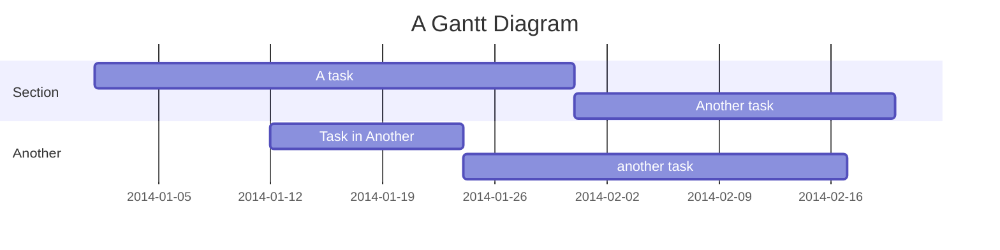

# pyomo-windows

Utilities to set up a pyomo environment in Windows. Installs `glpk`, `ipopt`and `cbc` solvers.

## Install

In your environment, install pyomo_environment with
```commandline
pip install pyomo_windows
```
## Download solvers
Before using any solver, they must be downloaded first. You can download solvers using the `DownloadSolvers` class:
```python
from pyomo_windows.solvers import DownloadSolvers
downloader = DownloadSolvers()
downloader.download_glpk()      # Download glpk
downloader.download_cbc()       # Download coin-cbc
downloader.download_ipopt()     # Download ipopt

```


## Use solvers
Create your pyomo model and before executing it, call `get_solver` to get the desired solver. Remember that solver must be downloaded first as explained [here](#download-solvers).

Example:

```python
# Create model normally
import pyomo.environ as pyo

model = pyo.ConcreteModel()
# Solve model
from pyomo_windows.solvers import SolverManager

solver_manager = SolverManager()
solver = "glpk"  # Or "cbc" or "ipopt"
opt = solver_manager.get_solver(solver)
res = opt.solve(model)
# Process your results...
```
### Troubleshooting
You might face errors in the first execution.
If in your install you cannot write in the default folder, try
Optionally, if you want models to be downloaded in a different location, by passing folder to `SolverManager`.
For example:
```python
# Create model normally
import pyomo.environ as pyo

model = pyo.ConcreteModel()
# Solve model
from pyomo_windows.solvers import SolverManager

solver_manager = SolverManager('write a valid folder path here')
solver = "glpk"  # Or "cbc" or "ipopt"
opt = solver_manager.get_solver(solver)
res = opt.solve(model)
# Process your results...
```


## Testing
Run tests in `test_solvers.py`. First execution will be slow as models have to be downloaded